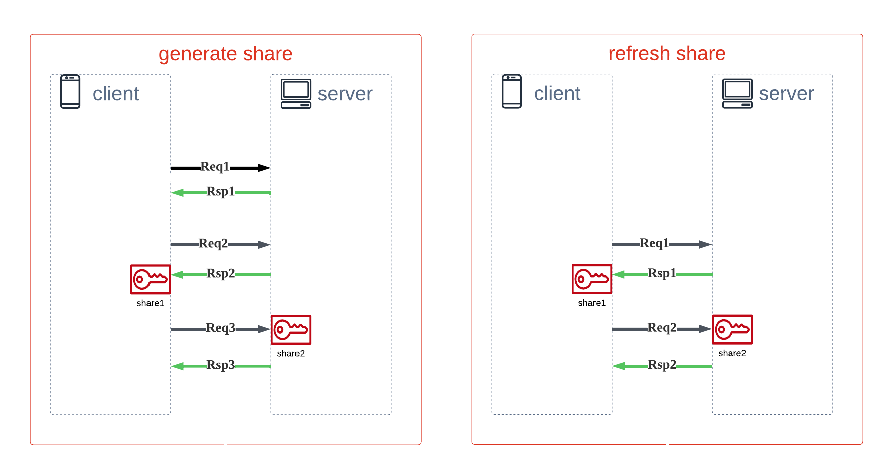

# MPCCrypto

本协议在 [unbound security](https://github.com/unboundsecurity/blockchain-crypto-mpc) 的基础上增加了消息传输层，同时提供了
party1 , party2 在分布式环境下的 share 一致性解决方案。

在实现过程中，我们将 party1 当作 client, party2 当作 server.

## share分布式一致存储

如图所示，generate_share 需要进行3次交互，refresh_share需要进行2次交互，都是先在客户端生成share,然后发送请求到服务端，服务端再生成share，最后服务端发送一个响应。

在 mpc 2/2 的场景中，我们只需要保证客户端的share (share1)总是可用的，share1 可用包括以下几点：

1. 客户端的每一个 share1 总是能够在服务端找到对应的 share2 。
2. 客户端的每一个 share1 在 refresh 成功后服务端的 share2 也进行了 refresh。(ub的实现中,refresh前后shareUid不变)

### Generate 阶段的一致性存储

client在sink share1 时启动事物，直到接收到 Rsp3 才能提交事物；    \
这样只有服务端有可能保存了无效到 share2 , （服务端返回的 Rsp3 丢包；  \
不过因为客户端每次发起请求时都会带上share的 shareUid， 所以不会导致服务端和客户端的 share 匹配不上。

### Refresh 阶段的一致性存储

在ub的实现过程中，refresh生成的新share和老share的 shareUid 没有改变。不能利用 Generate 阶段的服务端冗余来保证 share1
总是可用。看了ub 的 c++ 源码， 状态机和context的隔离都是通过 shareUid 来标识的，改动风险大。
如果直接暴露 share 的 set_uid 方法可以不改动状态机的逻辑，但是容易导致调用方误用产生bug。

